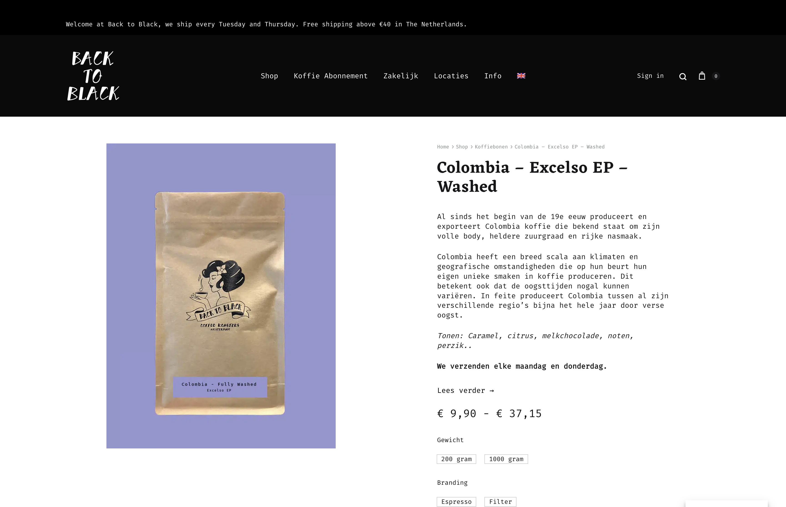

# Procesverslag
Markdown is een simpele manier om HTML te schrijven.  
Markdown cheat cheet: [Hulp bij het schrijven van Markdown](https://github.com/adam-p/markdown-here/wiki/Markdown-Cheatsheet).

Nb. De standaardstructuur en de spartaanse opmaak van de README.md zijn helemaal prima. Het gaat om de inhoud van je procesverslag. Besteedt de tijd voor pracht en praal aan je website.

Nb. Door *open* toe te voegen aan een *details* element kun je deze standaard open zetten. Fijn om dat steeds voor de relevante stuk(ken) te doen.

## Jij

  
uitwerken voor kick-off werkgroep

  ### Auteur:
  Amaro Lichtveld 

  #### Je startniveau:
  Ik neem de blauwe piste, omdat ik websites makes leuk vind maar loop vaak nog etegen code aan. Wel is mijn motivatie ook hoog waardoor ik een stuk sneller leer.

  #### Je focus:
  Ik neem de focus op responsive in het eerste geval. Ik wil eigenlijk ook wel een deel focussen op surface laag want micro intercaties vind ik persoonlijk leuk om mee aan de slag te gaan.
 

## Je website

  
uitwerken voor kick-off werkgroep

  ### Je opdracht:
https://backtoblackcoffee.nl/

  #### Screenshot(s) van de eerste pagina (small screen): 
  Homepagina
  

  #### Screenshot(s) van de tweede pagina (small screen):
  Product detailpagina
  
 

## Toegankelijkheidstest 1/2 (week 1)

  
uitwerken na test in 2e werkgroep

  ### Bevindingen
  Lijst met je bevindingen die in de test naar voren kwamen:

Geen skip-link naar de hoofdinhoud → veel tabben voor keyboard/screenreader-gebruikers.

Niet-logische headingstructuur (H1 “Shop”, daarna soms H5) → onduidelijk documentoverzicht.

Icon-knoppen zonder duidelijke tekst of aria-label (hamburger, cart, social icons).

Autoplay-video zonder duidelijke mogelijkheid om de beweging te stoppen.

Navigatie veel via iconen/slide-menu → mogelijk lastiger voor toetsenbordgebruikers.

## Breakdownschets (week 1)

  
uitwerken na afloop 3e werkgroep

  ### de hele pagina: 
  

  ### dynamisch deel (bijv menu): 
  

  ### wellicht nog een dynamisch deel (bijv filter): 
  

## Voortgang 1 (week 2)

  
uitwerken voor 1e voortgang

  ### Stand van zaken
De echte site heeft geen “skip to content” link waardoor je als gebruiker eerst door alle navigatie heen moet tabben. Ik heb een skip-link toegevoegd die meteen naar de main content springt. Dit is een kleine verbetering die veel scheelt voor screenreaders en toetsenbordgebruikers. Ook in het origineel zijn veel knoppen alleen iconen en zonder aria-label weet een screenreader niet wat die knop doet.
In mijn versie heb ik alle iconknoppen aria-labels gegeven zoals “Open menu” of “Naar winkelwagen”.
Alle afbeeldingen die informatie geven (producten, locaties, blogfoto) hebben bij mij een alt-tekst gekregen. Decoratieve dingen zouden alt="" krijgen. Dot heb ik gedaan want is beter voor screenreaders.

De originele site begint met H1 “Shop” maar heeft daarna ineens H5-koppen voor andere onderdelen. 
Ik heb één duidelijke H1 voor de pagina en daarna H2’s voor onderdelen zoals Shop, Locatie, Blog, etc. En ook heb ik bewust gewerkt met header, main, section, article en footer. Niet te veel onnodige divs. Zo blijft de site overzichtelijk.

Ik wilde twee producten naast elkaar zetten op mobiel formaat. Eerst dacht ik aan flexbox, maar dat zorgde ervoor dat de elementen niet mooi naast elkaar gingen zitten en niet goed schaalden.
Met hulp ben ik overgestapt op CSS Grid. Dat werkt veel netter voor mijn gevoel als je op mobiel 2 kolommen wilt en later op laptop automatisch 4 of 6 kolommen. Het geeft meer controle.

  ### Agenda voor meeting
  samen met je groepje opstellen

  | student 1      | student 2          | student 3    | student 4        |
  | ---            | ---                | ---          | ---              |
  | dit bespreken  | en dit             | en ik dit    | en dan ik dat    |
  | en dat ook nog | dit als er tijd is | nog een punt | dit wil ik zeker |
  | ...            | ...                | ...          | ...              |

  ### Verslag van meeting
  hier na afloop snel de uitkomsten van de meeting vastleggen

  - punt 1
  - punt 2
  - nog een punt
  - ...

## Voortgang 2 (week 3)

  
uitwerken voor 2e voortgang

  ### Stand van zaken
  hier dit ging goed & dit was lastig (neem ook screenshots op van delen van je website en code)

  ### Agenda voor meeting
  samen met je groepje opstellen

  | student 1      | student 2          | student 3    | student 4        |
  | ---            | ---                | ---          | ---              |
  | dit bespreken  | en dit             | en ik dit    | en dan ik dat    |
  | en dat ook nog | dit als er tijd is | nog een punt | dit wil ik zeker |
  | ...            | ...                | ...          | ...              |

  ### Verslag van meeting
  hier na afloop snel de uitkomsten van de meeting vastleggen

  - punt 1
  - punt 2
  - nog een punt
- ...

## Toegankelijkheidstest 2/2 (week 4)

  
uitwerken na test in 9e werkgroep

  ### Bevindingen
  Lijst met je bevindingen die in de test naar voren kwamen (geef ook aan wat er verbeterd is):

## Voortgang 3 (week 4)

  
uitwerken voor 3e voortgang

  ### Stand van zaken
  hier dit ging goed & dit was lastig (neem ook screenshots op van delen van je website en code)

  ### Agenda voor meeting
  samen met je groepje opstellen

  | student 1      | student 2          | student 3    | student 4        |
  | ---            | ---                | ---          | ---              |
  | dit bespreken  | en dit             | en ik dit    | en dan ik dat    |
  | en dat ook nog | dit als er tijd is | nog een punt | dit wil ik zeker |
  | ...            | ...                | ...          | ...              |

  ### Verslag van meeting
  hier na afloop snel de uitkomsten van de meeting vastleggen

  - punt 1
  - punt 2
  - nog een punt
  - ...

## Eindgesprek (week 5)

  
uitwerken voor eindgesprek

  ### Je uitkomst - karakteristiek screenshots:
  

  ### Dit ging goed/Heb ik geleerd: 
  Korte omschrijving met plaatjes

  

  ### Dit was lastig/Is niet gelukt:
  Korte omschrijving met plaatjes

  

## Bronnenlijst

  
continu bijhouden terwijl je werkt

  Nb. Wees specifiek ('css-tricks' als bron is bijv. niet specifiek genoeg). 
  Nb. ChatGpT en andere AI horen er ook bij.
  Nb. Vermeld de bronnen ook in je code.

  1. bron 1
  2. bron 2
  3. ...

